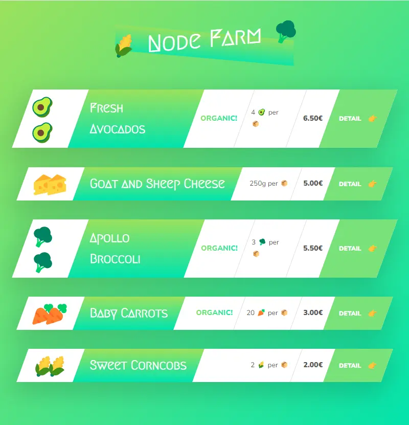

### 👋 **I am Erhan ERTEM**

&emsp;

## Udemy Node.js, Express, MongoDB & More The Complete Bootcamp 2022 by Jonas Schmedtmann

### **Objective:** Create a fun app utilizing nodejs

- Explore NodeJS Repl
- Explore NodeJS Documentation
- Node functionality:
  - Read and write files sync
  - Read and write files async
  - Layered async file operations
  - Create server
  - Establish Routing
- Create dynamic templates with placeholder inserts
  - Uilize new URL constructor
- Import/export modules within NodeJS app
- Import 3rd party npm package to nodeJS app

&emsp;

#### [NodeFarm-App](https://app-node-farm.onrender.com)

---

