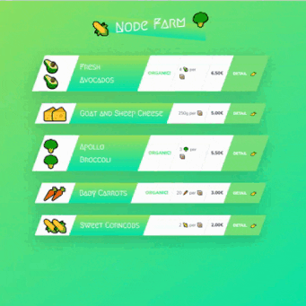

### 👋 **I am Erhan ERTEM**

&emsp;

## Udemy Node.js, Express, MongoDB & More The Complete Bootcamp 2022 by Jonas Schmedtmann

### **Objective:** Create a fun app utilizing nodejs

- Explore NodeJS Repl
- Explore NodeJS Documentation
- Node functionality:
  - Read and write files sync
  - Read and write files async
  - Layered async file operations
  - Create server
  - Establish Routing
- Create dynamic templates with placeholder inserts
  - Uilize new URL constructor
- Import/export modules within NodeJS app
- Import 3rd party npm package to nodeJS app

&emsp;

<!-- #### Link to Project &rarr; [NodeFarm-App](https://nodefarm-app-erhan-ertem.netlify.app) -->

#### Project Preview

---

 

#### Installed NPM packages and utilized APIs:

| Package command        | Package link                          | Description                                                         |
| ---------------------- | ------------------------------------- | ------------------------------------------------------------------- |
| npm install -g nodemon | https://www.npmjs.com/package/nodemon | Nodemon is a helper tool for developing Node.js based applications. |
| npm install slugify    | https://www.npmjs.com/package/slugify | Fill in spaces with \_ or - .                                       |

&emsp;
